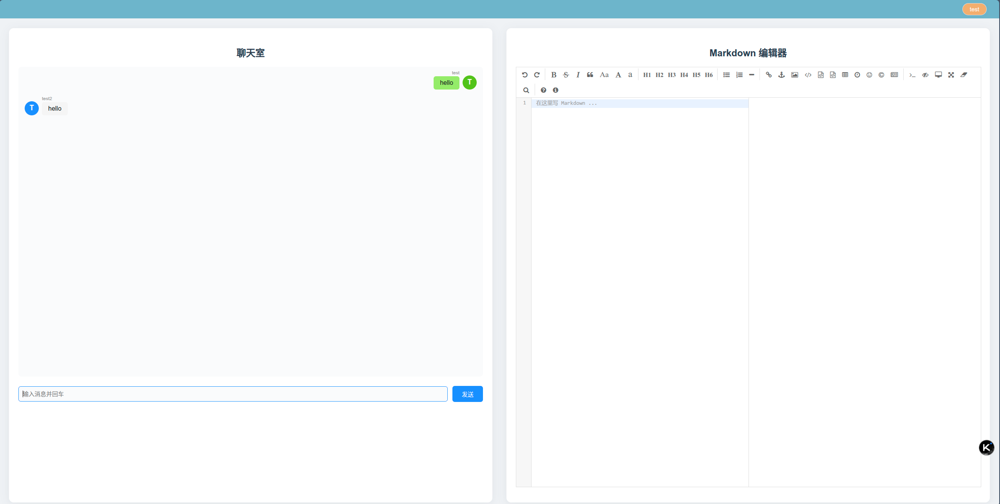
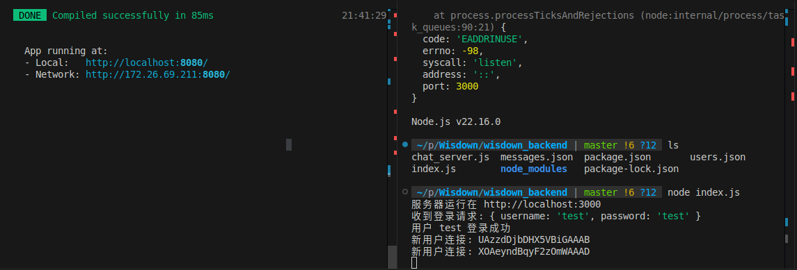

# Wisdown

## frontend

### Project setup
```
npm install
```

### Compiles and hot-reloads for development
```
npm run serve
```




## backend
```
node index.js
```


目前用户信息保存在users.json文件，聊天消息保存在message.json文件

## ipconfig.js
将config.js配置文件更改为后端服务运行的ip地址