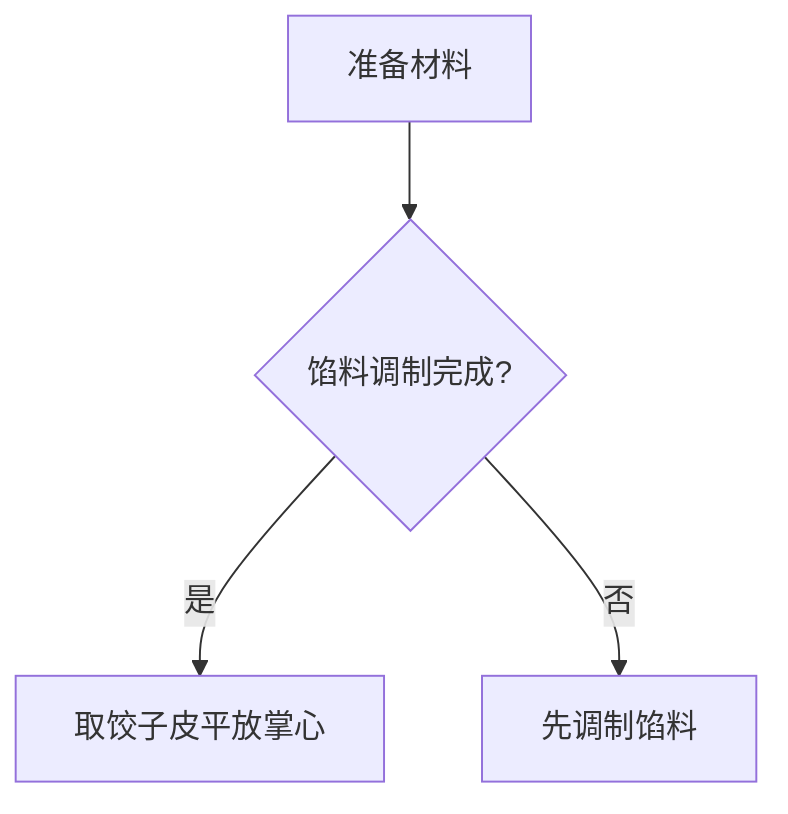
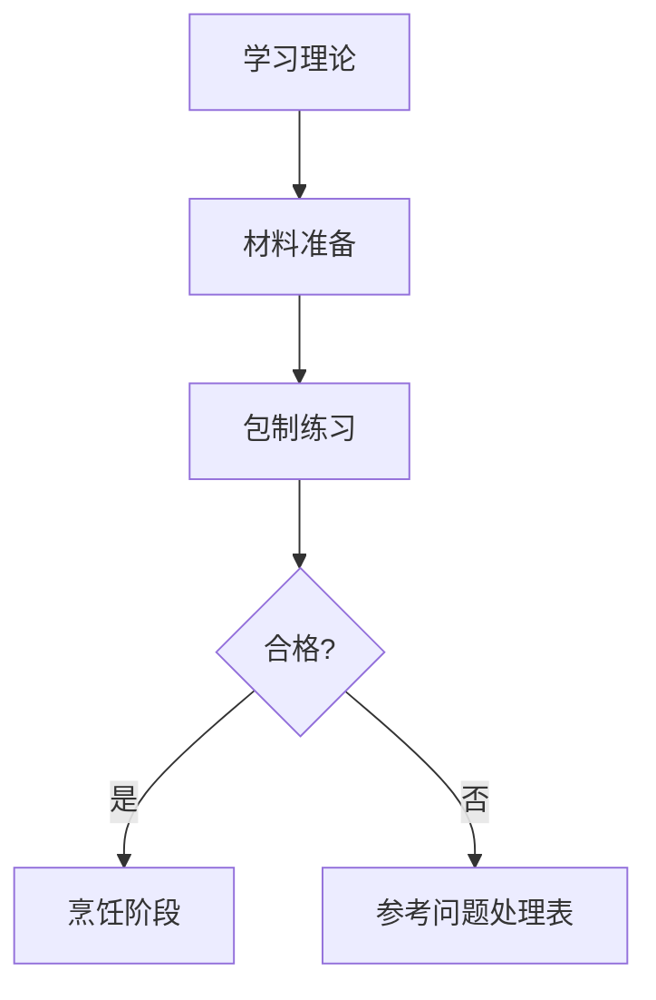

```markdown
# 包饺子全流程指南

## 一、所需材料与工具
### 材料清单：
- 饺子皮（自制或市售）
- 馅料（常见种类：猪肉大葱/三鲜/素菜等）
- 水（用于封口）

### 工具准备：
- 平底盘/湿布（防饺子粘连）
- 筷子/勺子（舀馅用）
- 筷子/手指（捏褶工具）

## 二、标准操作流程

### 1. 准备工作


### 2. 包制步骤
#### 步骤分解：
1. **舀馅置中**  
   用筷子/小勺取约15g馅料置于饺子皮中央

2. **对折封口**  
   - 将饺子皮两端对折后捏紧中间
   - **关键点**：排出空气防止煮制爆裂

3. **捏褶成型**  
   ```mermaid
   sequenceDiagram
       食指.->>拇指: 左手三指固定边缘
       右手食指-->>左手虎口: 由内向外推压形成褶皱
       注释: 目标褶皱数≥5个确保密封性
   ```

4. **摆放定型**  
   - 将包好的饺子间隔摆放在铺好湿布的容器中
   - **注意**：避免粘连影响煎煮效果

### 3. 进阶技巧
| 问题场景       | 解决方案                     |
|----------------|----------------------------|
| 馅料溢出       | 减少馅量/增加捏褶密度       |
| 饺子皮破洞     | 用多余面团补丁             |
| 口感不紧实     | 馅料适当增加淀粉分（如藕粉）|

## 三、常见问题处理
```mermaid
flowchart TB
    A[饺子粘连] --> B[撒干面粉隔离]
    C[褶皱不整齐] --> D[练习"推挤"手法]
    E[煮制破皮] --> F[水沸后下锅/转小火]
```

## 四、流程图总览


> 小贴士：新手建议从"半月形"基础款练习，熟练后再尝试元宝形、花边形等进阶造型
```